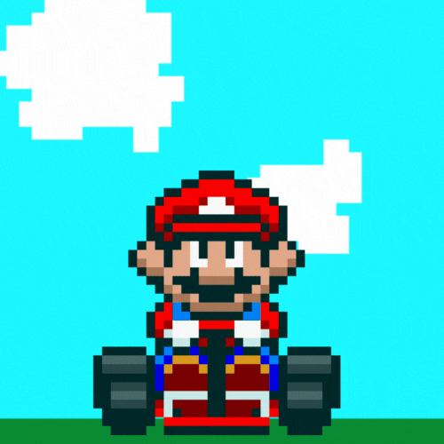
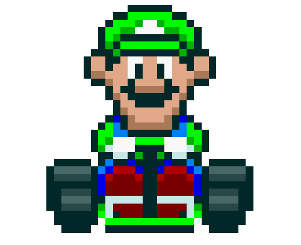
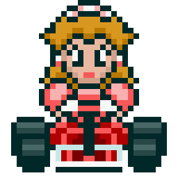
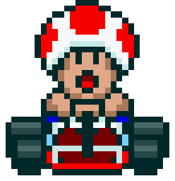
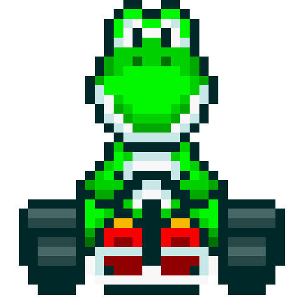

<h1> Desafio - Simulador de Corridas do Mario Kart (Java)</h1>
<h2>Sobre o Projeto</h2>
Este projeto é um simulador de corridas com personagens icônicos, onde os usuários podem escolher dois competidores e acompanhá-los em uma corrida dinâmica e imprevisível. 

O simulador combina elementos de estratégia, aleatoriedade e interação direta com o usuário, criando uma experiência de jogo envolvente.  
O projeto foi desenvolvido utilizando a linguagem de programação Java, a lógica foi baseado no meu projeto anterior em JavaScript.

<h3>Mario Kart</h3>
<table>
<td>

</td>
</table>
<h6>Mario Kart é uma das séries de jogos de corrida mais icônicas da Nintendo.</h6>

Lançada pela primeira vez em 1992 com "Super Mario Kart" para o Super Nintendo Entertainment System (SNES), a série é conhecida por seu estilo divertido e caótico, que mistura corridas rápidas com elementos de combate e power-ups.</h6>

<h3>Jogadores</h3>
<table>
<tr>
    <td align="center">
        
<b>Mario</b>

        
    </td>
    <td>
        
Velocidade: 4

        
Manobrabilidade: 3

        
Poder: 3

    </td>
    <td align="center">
        
<b>Luigi</b>

        
    </td>
    <td>
        
Velocidade: 3

        
Manobrabilidade: 3

        
Poder: 4

    </td>
    <td align="center">
        
<b>Peach</b>

        
    </td>
    <td>
        
Velocidade: 4

        
Manobrabilidade: 4

        
Poder: 2

    </td>

<tr>
    <td align="center">
        
<b>Bowser</b>

        
    </td>
    <td>
        
Velocidade: 5

        
Manobrabilidade: 2

        
Poder: 5

    </td>
    <td align="center">
        
<b>Toad</b>

        
    </td>
    <td>
        
Velocidade: 3

        
Manobrabilidade: 5

        
Poder: 1

    </td>
    <td align="center">
        
<b>Yoshi</b>

        
    </td>
    <td>
        
Velocidade: 3

        
Manobrabilidade: 3

        
Poder: 3

    </td>
</tr>
</table>
<h3>
<b>Como Jogar:</b>
</h3>

Escolha dos Personagens:
Cada jogador escolhe um personagem de uma lista predefinida, como Mario, Luigi, Peach, Bowser, Toad, ou Yoshi.  
Os personagens têm atributos únicos: Velocidade, Manobrabilidade e Poder, que influenciam o desempenho nas corridas.

Rodadas de Corrida:
O jogo é dividido em 5 rodadas.  
Em cada rodada, um bloco de pista é sorteado, podendo ser "RETA", "CURVA" ou "CONFRONTO".  
RETA: Corridas baseadas na Velocidade dos personagens.  
CURVA: Corridas baseadas na Manobrabilidade dos personagens.  
CONFRONTO: Uma disputa direta onde os personagens usam seu Poder para ganhar vantagem.

Confronto Direto:
Quando o bloco é "CONFRONTO", o personagem com o maior resultado de Poder ganha a rodada e o adversário pode perder pontos.

Pontuação:
Os pontos são ganhos ou perdidos com base no resultado das corridas e confrontos.  
Após cada rodada, o jogador com o maior resultado na habilidade relevante (Velocidade ou Manobrabilidade) ganha um ponto.

Declaração do Vencedor:
Após 5 rodadas, o jogador com mais pontos é declarado o vencedor da corrida.  
Em caso de empate, a corrida é considerada um empate.

Objetivo Final:
Ganhe o maior número de pontos possível através de corridas e confrontos para ser coroado o vencedor da corrida.
